# School_District_Analysis

## Introduction

There has been evidence of academic dishonesty on reading and math grades for Thomas High School ninth graders, where they appear to have been altered. Thus, these grades were then replaced with NaNs (Not a Number) while keeping the rest of the data intact.

## Project Overview

The main purpose of this project is to evaluate how replacing the ninth graders’ math and reading scores affected the school district analysis.
This was accomplished by redoing the analysis after the ninth graders’ math and reading scores were replaced.

## Analysis

### Replacing the Scores

The loc method was used to select all the reading and math scores from the ninth grade at Thomas High School, as shown on the two images below:

Loc Method on Reading Scores 

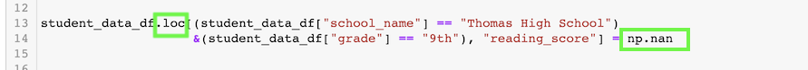

Loc Method on Math Scores

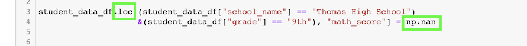

### Student DataFrame

The reading and math scores for the ninth graders in Thomas High school were replaced with NaNs, as seen on the following images:

- Student DataFrame Original

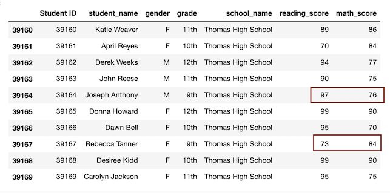

- Student DataFrame New

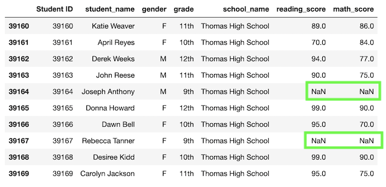

## Results

### District Summary DataFrame

- Average Math Score had a slight decrease from 79.0 to 78.9 representing a drop of 1%.

- Average Reading Score didn't have any difference as of looking at the results with one decimal point.

- % Passing Math changed from 75% to 74.8%, showing a drop of 0.2%.

- % Passing Reading changed from 85.8% to 85.7%, with a 0.1% drop.

- % Overall Passing changed from 65.2% to 64.9%, with a drop of 0.3%.

All the changes above are represented on the images below:

Original District Summary DataFrame

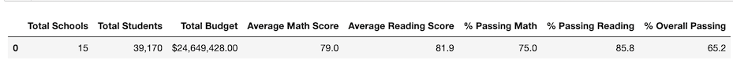

New District Summary DataFrame 

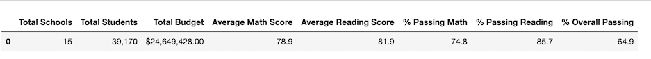

### Per School Summary DataFrame

The new analysis of the Per School Summary DataFrame presented some changes on Thomas High School results. These changes are descrides on the bullet points bellow and then supported with images of the original and new school summary. 

- Average Math Score changed from 83.42 to 83.35 with a slight drop of 0.7%

- Average Reading Score had a slight increase from 83.85 to 83.90 representing 0.5% 

- % Passing Math changed from 93.27% to 93.19% with a drop of 0.08%

- % Passing Reading changed 97.31% to 97.02% with a drop of 0.29%

- % Overall Passing changed 90.95% to 90.63% with a drop of 0.32%

These changes are represented on the images below:

- Per School Summary Original

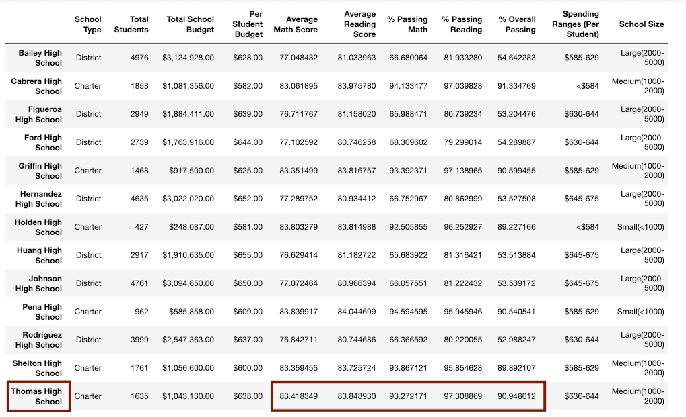

- Per School Summary New

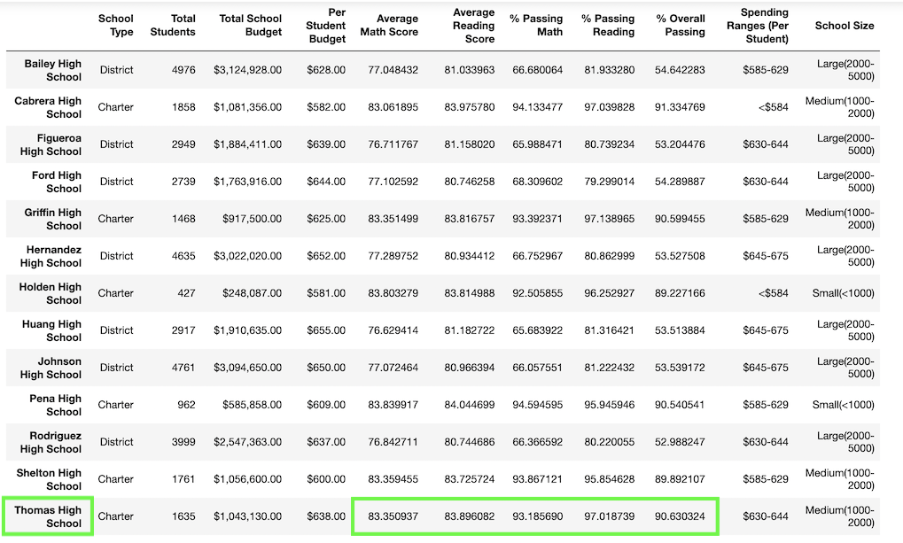

### Top 5 Performing Schools

The images below represent the original and new top 5 performing schools based on the overall passing rate. Where the top 5 schools remained the same, as well as their sequence in the top 5 rank.

- Top 5 Performing Schools Original

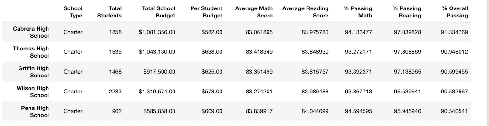

- Top 5 Performing Schools New

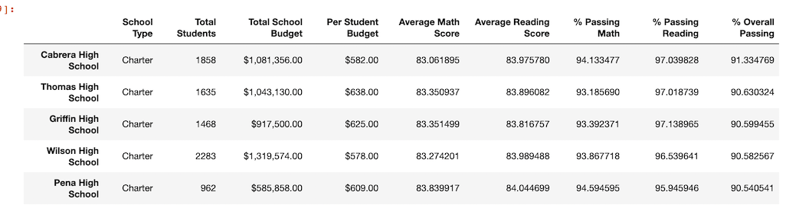

### Bottom 5 Performing Schools

As shown on the following images there were no changes on the bottom 5 schools based on the overall passing rate, and their sequence on the rank.

- Bottom 5 Performing Schools Original 

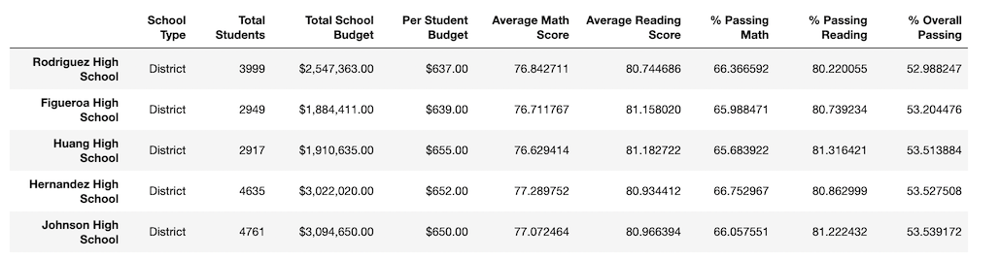

- Bottom 5 Performing Schools New

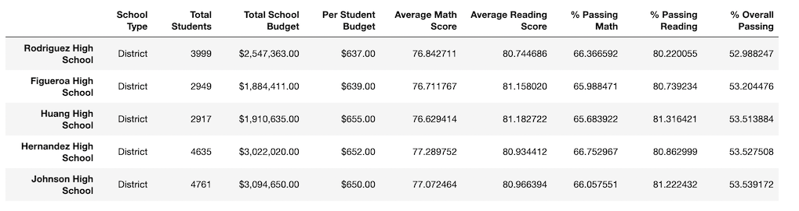

### Math and reading Scores by Grade

Looking at the math and reading scores for Thomas High School, there were no changes. Which means the replacement dind't have an affect on the other grades.

- The average math score for each grade level from each school 

Original

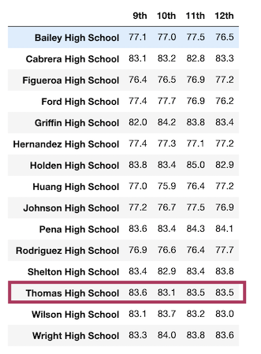

After replacement

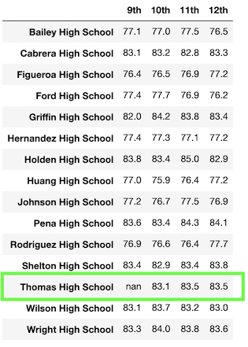

- The average reading score for each grade level from each school 

Original

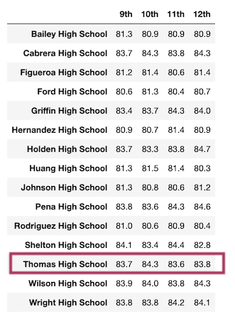

After replacement

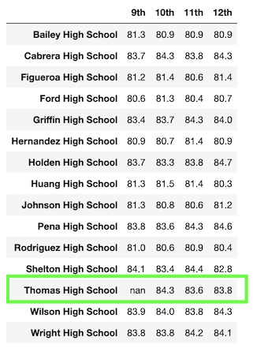

### Scores by School Spending

As it can be seen on the images bellow, there were no changes on scores by school spending per student after the replacement.

- Original Scores by School Spending per Student

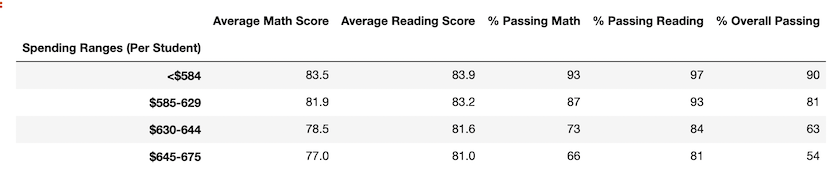

- Original Scores by School Spending per Student

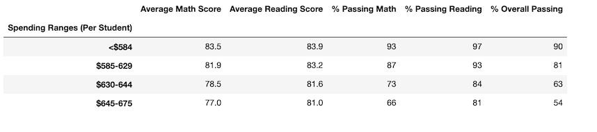

### Scores by School Size 

The replacement had no affect on the scores by school type, as shown below:

- Original Scores by School Size

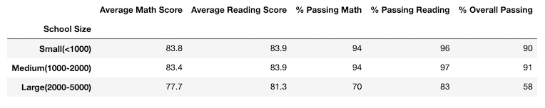

- New Scores by School Size

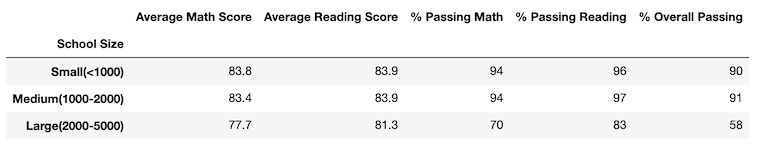

### Scores by School Type 

The following images support that there were no effect on the scores by school type after the replacement.

- Original Scores by School Type

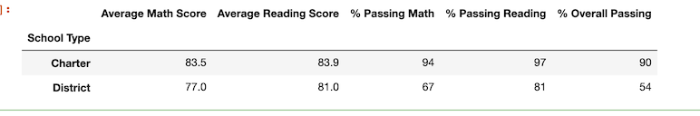

- New Scores by School Type

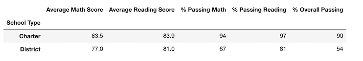

## Summary

### Affected Areas

After the Reading and Math Scores for the ninth grade at Thomas High School were replaced with NaNs, there were four main changes affecting the school district analysis. 
Two of them can be seen on the District Summary DataFrame, showing that the Average Math Score dropped 1% and the % Overall Passing dropped 0.3%. 
The other two main changes happened on the School Summary DataFrame, where the Average Math Score dropped by 0.7% and the Average Reading Score increased by 0.5%, making the last one the only increase in the analysis.

### Non Affected Areas 

The replacement didn't have any effect on the performance of the other schools, the top 5 and bottom 5 schools were kept the same and the same sequence, where even though Thomas High School had a slight difference in the scores it was still ranked the 2nd on the top 5 schools. 
There wasn't any effect on the math and reading scores by grade for none of the schools, besides the Thomas High School' 9th grade scores that was replaced with NaNs.
In addition, there was also no change in the scores by school spending, scores by school size, and scores by school type.

The replacement didn’t show any effect on these dataFrames because the number of students that were not being counted was very small relative to the overall amount of students per school, this way the difference didn't show up using one decimal point. 

